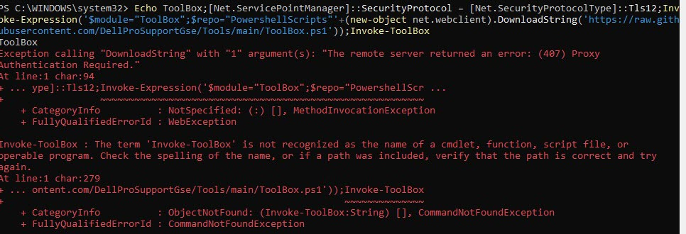

# Tools
  NOTE: All tools should be run from ISE as administorator unless otherwise noted. 

### Licensing/Support
We'd like to inform you that this code is freely available under the [MIT License](https://github.com/DellProSupportGse/Tools/blob/main/License) and is utilized by numerous individuals worldwide on a daily basis. Should you encounter any challenges, we kindly request you to submit them via the designated "Issues" section. Your contributions are greatly appreciated.

-------------------------------------------------------------------------------------------------------------------------------------------------
## Tool Box
Tool Box is a menu of all the tools to run them from one place
	 
   
   
### Usage
Copy the below powershell code and paste into PowerShell
```Powershell
Echo ToolBox;[Net.ServicePointManager]::SecurityProtocol = [Net.SecurityProtocolType]::Tls12;Invoke-Expression('$module="ToolBox";$repo="PowershellScripts"'+(new-object net.webclient).DownloadString('http'+'s://raw.githubusercontent.com/DellProSupportGse/Tools/main/ToolBox.ps1'));Invoke-ToolBox
```
### Issue:
##### If you see the following error:

### Solution:
 	$browser = New-Object System.Net.WebClient;$browser.Proxy.Credentials =[System.Net.CredentialCache]::DefaultNetworkCredentials;Echo ToolBox;[Net.ServicePointManager]::SecurityProtocol = [Net.SecurityProtocolType]::Tls12;Invoke-Expression('$module="ToolBox";$repo="PowershellScripts"'+(new-object net.webclient).DownloadString('http'+'s://raw.githubusercontent.com/DellProSupportGse/Tools/main/ToolBox.ps1'));Invoke-ToolBox
-------------------------------------------------------------------------------------------------------------------------------------------------
## APEX VM Log Collection
   This script is used to collect logs from a APEX VM
	
### Usage
Copy the code and paste it into the terminal on your APEX VM after elevating to root
```Bash
curl -sSL https://raw.githubusercontent.com/DellProSupportGse/Tools/refs/heads/main/log_collect.sh -o ./log_collect.sh && chmod 755 log_collect.sh && bash ./log_collect.sh
``` 
-------------------------------------------------------------------------------------------------------------------------------------------------
## AzHCIUrlChecker
   This script checks the URLs that the Azure Stack HCI operating system may need to access as per Microsoft Doc: 
	https://docs.microsoft.com/en-us/azure-stack/hci/concepts/firewall-requirements
	
### Usage
Copy the below powershell code and paste into PowerShell
```Powershell
Echo AzHCIUrlChecker;[Net.ServicePointManager]::SecurityProtocol = [Net.SecurityProtocolType]::Tls12;Invoke-Expression('$module="AzHCIUrlChecker";$repo="PowershellScripts"'+(new-object net.webclient).DownloadString('http'+'s://raw.githubusercontent.com/DellProSupportGse/Tools/main/AzHCIUrlChecker.ps1'));Invoke-AzHCIUrlChecker
``` 
-------------------------------------------------------------------------------------------------------------------------------------------------
## BOILER
   Filters the CBS/DISM logs for Errors/Fails/Warnings to quickly identify failing KB's, Language Tags or
   corruption plus, it provides Suggested fixes.
   
   
   
   ### Documentation:
    1. Copy/Paste PowerShell code below
    2. Answer the Rady to run? Y/N
    3. Provide the log to analize in the popup
          - Supports running locally or remotly by feeding it a ZIP file of the logs or just log file.
    4. Review the output for the finds and suggested fixes
    
   ### Supported Scenarios:
    - Failing KBs
        Shows any KBs that are failing to install, provides the link to download them if available and the how to DISM install it for best success.
    - Failing Language Packs
        Shows any language tag that is failing with the process to download and install to repair it
    - Corruption identified by the log
        Show any corruption identified in the log and the steps to restore health with eval ISO
    - Display Errors, Fails and Warnings
        If no other scenario is found but we still see Errors, Fails and Warnings then they are displayed
    
   ### PowerShell
```Powershell
[Net.ServicePointManager]::SecurityProtocol = [Net.SecurityProtocolType]::Tls12;Invoke-Expression('$module="BOILER";$repo="PowershellScripts"'+(new-object net.webclient).DownloadString('http'+'s://raw.githubusercontent.com/DellProSupportGse/Tools/main/BOILER.ps1'));Invoke-BOILER
```   
  
-------------------------------------------------------------------------------------------------------------------------------------------------
## DART
**DO NOT USE on 23H2**

   **D**ell **A**utomated se**R**ver upda**T**er is a Windows Failover Cluster and HCI/S2D aware tool that will automatically download and 
   install Windows Updates, Drivers/Firmware on Dell Servers.
  
  
  
  How To Use:
    From PowerShell as admin execute the following:
```Powershell
[Net.ServicePointManager]::SecurityProtocol = [Net.SecurityProtocolType]::Tls12;Invoke-Expression('$module="DART";$repo="PowershellScripts"'+(new-object net.webclient).DownloadString('http'+'s://raw.githubusercontent.com/DellProSupportGse/Tools/main/DART.ps1'));Invoke-DART
```

### Documentation:
   1. Checks to make sure your running on a Dell server
   2. Checks to see if have the latest Dell System Update is installed
   3. If not then it downloads and installs the latest version of DSU
   4. Is Azure Stack HCI (Storage Spaces Direct Ready Node or AX node)
      - We download and extract the AZHCI-Catalog to use with DSU
      - We Pause & Drain the node and Enable Storage Maintenance Mode
      - Installs Windows Updates (Only pre 23H2 OS releases)
      - Runs DSU
        - No reboot required: We resume the node, disable Storage Maintenance Mode and show Installation Report
        - Reboot Required: We setup a logon task that will resume the node and disable Storage Maintenance Mode after the reboot and logon
        - Failed Update: We show you the failed update and exit so we can look into the errors and decide how to proceed.
   6. Is Cluster member
      - We Pause & Drain the node and Enable Storage Maintenance Mode
      - Installs Windows Updates
      - Runs DSU
        - No reboot required: We resume the node and show Installation Report
        - Reboot Required: We setup a logon task that will resume the node after the reboot and logon
        - Failed Update: We show you the failed update and exit so we can look into the errors and decide how to proceed.
   8. Is Regular Power Edge Server
      - Installs Windows Updates 
      - Runs DSU
        - No reboot required: Show Installation Report
        - Failed Update: We show you the failed update and exit so we can look into the errors and decide how to proceed.
   
   Transcript Logging: C:\ProgramData\Dell\DART
   
   Use -IgnoreChecks:$True to install updates without suspending cluster node or enabling storage maintenance mode for Azure Stack HCI
   
   Use -IgnoreVersion:$True to ignore the block to Dell updates if MS Solution Update is deployed
   
-------------------------------------------------------------------------------------------------------------------------------------------------
## FLEP
   
   This tool is used to filter Windows event logs.
 
 
   
  ### Supported Scenarios:
    
      1 Filter System Event logs
        Filters the system event log for the 24 most common events 13,20,28,41,57,129,153,134,301,1001,1017,1018,1135,5120,6003-6009
      2 Filter for 505 Events
        Filters the Microsoft-Windows-Storage-Storport/Operational event logs for event id 505 to be able to see S2D/HCI storage latancy buckets
    
   ### PowerShell
```Powershell
[Net.ServicePointManager]::SecurityProtocol = [Net.SecurityProtocolType]::Tls12;Invoke-Expression('$module="FLEP";$repo="PowershellScripts"'+(new-object net.webclient).DownloadString('http'+'s://raw.githubusercontent.com/DellProSupportGse/Tools/main/FLEP.ps1'));Invoke-FLEP
```  
   
-------------------------------------------------------------------------------------------------------------------------------------------------
## GetHyperVBottlenecks
   
   This is a tool to detect bottlenecks in a Hyper-V environment
     
   How To Use: 
      From PowerShell as admin execute the following and follow the prompts:
```Powershell
[Net.ServicePointManager]::SecurityProtocol = [Net.SecurityProtocolType]::Tls12;Invoke-Expression('$module="GetHyperVBottlenecks";$repo="PowershellScripts"'+(new-object net.webclient).DownloadString('http'+'s://raw.githubusercontent.com/DellProSupportGse/Tools/refs/heads/main/GetHyperVBottlenecks.ps1'));Invoke-GetHyperVBottlenecks
```
-------------------------------------------------------------------------------------------------------------------------------------------------
## iDRAC Connection Manager
   
   iDRACCMan provides simplified iDRAC access using PowerShell Windows Forms interface for managing Dell iDRAC
    GUI and console sessions from a grouped server tree.
   
   
   
   How To Use: 
      From PowerShell as admin execute the following and follow the prompts:
```Powershell
[Net.ServicePointManager]::SecurityProtocol=[Net.SecurityProtocolType]::Tls12;$wc=New-Object Net.WebClient;$wc.Encoding=[System.Text.Encoding]::UTF8;Invoke-Expression('$module="iDRACCMan";$repo="PowershellScripts"'+$wc.DownloadString('http'+'s://raw.githubusercontent.com/DellProSupportGse/Tools/refs/heads/main/iDRACCMan/iDRAC-ConnectionManager.ps1'))
```
-------------------------------------------------------------------------------------------------------------------------------------------------
## KeyRelay
   
   This is a GUI tool to send text to applications that do not allow pasting.
   
   
   
   How To Use: 
      From PowerShell as admin execute the following and follow the prompts:
```Powershell
Echo KeyRelay;[Net.ServicePointManager]::SecurityProtocol = [Net.SecurityProtocolType]::Tls12;Invoke-Expression('$module="KeyRelay";$repo="PowershellScripts"'+(new-object net.webclient).DownloadString('http'+'s://raw.githubusercontent.com/DellProSupportGse/Tools/main/KeyRelay.ps1'));Invoke-KeyRelay
```

-------------------------------------------------------------------------------------------------------------------------------------------------
## LogCollector
   
   This tool is used to collect all the logs Switches, Servers and OS
   
   
   
   How To Use: 
      From PowerShell as admin execute the following and follow the prompts:
```Powershell
[Net.ServicePointManager]::SecurityProtocol = [Net.SecurityProtocolType]::Tls12;Invoke-Expression('$module="LogCollector";$repo="PowershellScripts"'+(new-object System.net.webclient).DownloadString('http'+'s://raw.githubusercontent.com/DellProSupportGse/Tools/main/LogCollector.ps1'));Invoke-LogCollector
```
-------------------------------------------------------------------------------------------------------------------------------------------------
## GetShowTech
   
   This tool is used to collect Dell switch logs
   
   How To Use: 
      From PowerShell as admin execute the following and follow the prompts:
```Powershell
[Net.ServicePointManager]::SecurityProtocol = [Net.SecurityProtocolType]::Tls12;Invoke-Expression('$module="GetShowTech";$repo="PowershellScripts"'+(new-object System.net.webclient).DownloadString('http'+'s://raw.githubusercontent.com/DellProSupportGse/Tools/main/GetShowTech.ps1'));Invoke-GetShowTech
```
-------------------------------------------------------------------------------------------------------------------------------------------------
## Run SDDC
 How To Use:
    From ISE or PowerShell as admin execute the following:
```Powershell
[Net.ServicePointManager]::SecurityProtocol = [Net.SecurityProtocolType]::Tls12;Invoke-Expression('$module="SDDC";$repo="PowershellScripts"'+(new-object net.webclient).DownloadString('http'+'s://raw.githubusercontent.com/DellProSupportGse/Tools/main/RunSDDC.ps1'));Invoke-RunSDDC
```
-------------------------------------------------------------------------------------------------------------------------------------------------
# Using SDDC Offline Tool

## Step 1: Prepare Files

### On a machine with internet access:

1. Download the **SDDC master file**:  
   [https://github.com/DellProSupportGse/PrivateCloud.DiagnosticInfo/archive/master.zip](https://github.com/DellProSupportGse/PrivateCloud.DiagnosticInfo/archive/master.zip)
2. Copy the file.

### RDP into a cluster node:

1. If **Sconfig** launches, choose **option 15** to exit to PowerShell.
2. Launch **Notepad** (type `notepad`).
3. Use **File > Save As** to paste and save `master.zip`.


## Step 2: Get the Script

### On the internet-connected machine:

1. Go to [https://github.com/DellProSupportGse/Tools/SDDCOffline.ps1](https://raw.githubusercontent.com/DellProSupportGse/Tools/refs/heads/main/SDDCOffline.ps1).
2. Click **Raw**, then press **Ctrl + A** to select all and **Ctrl + C** to copy.

### Back in the RDP session:

1. Paste the script into **PowerShell** and press **Enter**.
2. Type **y** when prompted to run and confirm local copy.
3. Browse to `C:\Dell`, select the `master.zip` file, and click **Open**.


## Step 3: Run & Finish

- The tool extracts to all nodes and starts data collection (takes several minutes).  
- When prompted, choose to delete (**y**) or keep (**n**) the master file.  
- Output will be saved in: C:\Users\<current user>\, starting with (**HealthTest**).
	   
-------------------------------------------------------------------------------------------------------------------------------------------------
## TSR Collector
   This tool is used to collect TSRs from
    all nodes in a cluster"

  How To Use:
    From ISE or PowerShell as admin execute the following:
```Powershell
[Net.ServicePointManager]::SecurityProtocol = [Net.SecurityProtocolType]::Tls12;Invoke-Expression('$module="TSRCollector";$repo="PowershellScripts"'+(new-object net.webclient).DownloadString('http'+'s://raw.githubusercontent.com/DellProSupportGse/Tools/main/TSRCollector.ps1'));Invoke-TSRCollector
```
-------------------------------------------------------------------------------------------------------------------------------------------------
## TALI
   This tool is used to test Dell Azure Local clusters for common issues
   
  
  
  How To Use:
    From PowerShell as admin execute the following:
```Powershell
Echo TALI;[Net.ServicePointManager]::SecurityProtocol = [Net.SecurityProtocolType]::Tls12;Invoke-Expression('$module="TALI";$repo="PowershellScripts"; '+(new-object net.webclient).DownloadString('http'+'s://raw.g'+'ithubusercontent.com/DellProSupportGse/Tools/main/TALI.ps1'));Test-DellAzureLocalIssues
```
Here is an example of a run of TALI
## Test-DellAzureLocalIssues Output

```
v0.653
______   ______     __         __
/\__  _\ /\_  _ \   /\ \       /\ \
\/_/\ \/ \ \   **\  \ \ \**__  \ \ \
   \ \_\  \ \_\ \_\  \ \_____\  \ \_\
    \/_/   \/_/\/_/   \/_____/   \/_/
                      by: Tommy Paulk
Logging Telemetry Information...
  Resolving Geo Location...
    Country: United States
    Region : Texas
  Telemetry recorded successfully
Checking for running action plans
VERBOSE: Looking up shared vhd product drive letter.
VERBOSE: Acquiring providers for assembly: ...PackageManagement.NuGetProvider.dll
VERBOSE: Acquiring providers for assembly: ...PackageManagement.ArchiverProviders.dll
VERBOSE: Acquiring providers for assembly: ...PackageManagement.CoreProviders.dll
VERBOSE: Acquiring providers for assembly: ...PackageManagement.MsuProvider.dll
VERBOSE: Acquiring providers for assembly: ...PackageManagement.MetaProvider.PowerShell.dll
VERBOSE: Acquiring providers for assembly: ...PackageManagement.MsiProvider.dll
VERBOSE: Suppressed Warning Unknown category for 'NuGet'::'GetDynamicOptions': 'Provider'
VERBOSE: Get-Package returned with Success:True
VERBOSE: Found package Microsoft.AzureStack.LcmUpdateService.PowerShell with version 2.2604.0.40
WARNING: Unable to find volume with label Deployment
VERBOSE: Found package Microsoft.AzureStack.Solution.Deploy.EnterpriseCloudEngine.Client.Deployment with version 10.2604.0.1251
```

```diff
  Testing WMI, VMMS and Cluster service
+ ✓ All nodes WMI, VMMS and Cluster services check out

  Checking Solution Update command...
+ ✓ Get Solution Update command successful

  Checking Net Intents...
+ ✓ Net Intent check successful

  Checking iDrac host nics have DHCP enabled...
+ ✓ All iDrac host network adapters have DHCP enabled
```
<details>
<summary><u>Expand remaining output</u></summary>
```diff
  Checking iDrac redfish url...
+ ✓ All hosts can access their iDrac redfish url

  Testing that all nodes have been rebooted within 99 days...
+ ✓ All nodes have been rebooted within 99 days

  Testing that all nodes have the HWTimeout registry key set to at least 10000...
+ ✓ All nodes have HWtimeout set to at least 10000

  Testing that all nodes have the VM migration performance option set to SMB...
+ ✓ All nodes have SMB for the VM migration performance option

  Testing if nodes are up but disks are still in maintenance mode...
+ ✓ All disks are in proper status

  Testing that all nodes have the same time zone...
+ ✓ All nodes have the same time zone

  Testing cluster shutdown timeout...
+ ✓ Cluster shutdown time in minutes is set correctly

  Testing for invalid CAU Reports...
+ ✓ Cluster nodes have no invalid CAU Reports

  Testing for invalid compute Net Intent Network Direct configuration...
+ ✓ Compute Net Intents Network Direct are configured correctly

  Testing for invalid Net Intent Network Direct Technology configuration on storage intents...
+ ✓ Storage Net Intents Network Direct Technology are configured correctly

  Analyzing non-Windows VM live migration / failback failures (last 7 days across all nodes)...
+ ✓ No migration or failback failures detected in last 7 days

  Checking per node services vital to Azure local...
+ ✓ All Azure local required node services are running

  Testing for Over Provisioned Virtual Disks on Storage Pool
! ⚠ If volumes are filled, there will not be enough space for disk repairs. -1050 GB
    Each node virtual disk can be up to 1.67 TB
    Recommendation: Make sure Storage Pool space does not run below best practice levels

  Testing Virtual Disk Thin Provisioning Alert Threshold
+ ✓ Thin Provisioning Alert Threshold is set correctly

  Testing cluster memory N-1 resiliency (largest-node failure model)...
+ ✓ Cluster is N-1 safe for memory (headroom: 224 GB)

  Testing cluster CPU vCPU overcommit risk (N-1 model, 200% threshold)...
+ ✓ CPU overcommit within acceptable N-1 threshold

  Looking at physical disk latency in the past week...
+ ✓ All physical disks passed

  Testing that Get-HealthFault command works
+ ✓ Get-HealthFault command succeeded

  Testing for mismatched PS module errors
+ ✓ No mismatched PS modules found

  Testing Control Plane VM network...
- ✖ Azure Control Plane VM with IP 100.72.44.142 is not healthy!
-   Recommendation: Reboot the Control Plane VM

  Testing Aks Arc Known Issues...
  Running test: Failover Cluster service not responsive or not running with ID: FC-0011
  Running test: Registry path missing for the MOC PS Config with ID: MOC-0019
  Running test: MOC Not on Latest Patch Version with ID: MOC-0001
  Running test: MOC missing Cloud agent Issues with ID: MOC-0012
  Running test: MOC Cloud Agent Not Running with ID: MOC-0003
  Running test: MOC Admin Token Expiry with ID: MOC-0010
  Running test: MOC Missing Node Agent Issues with ID: MOC-0011
  Running test: MOC Missing MocHostAgent Issues with ID: MOC-0014
  Running test: MOC NodeAgent Cert Hostname Drift with ID: MOC-0021
  Running test: MOC Expired Certificates with ID: MOC-0013
  Running test: MOC Nodes Not Active with ID: MOC-0004
  Running test: MOC Nodes Out of Sync with Cluster Nodes with ID: MOC-0005
  Running test: Multiple MOC Cloud Agent Instances with ID: MOC-0006
  Running test: MOC Powershell Stuck in Updating State with ID: MOC-0007
  Running test: Windows Event Log Not Running with ID: MOC-0008
  Running test: Gallery Image Stuck in Deleting State with ID: MOC-0009
  Running test: Virtual Machine Stuck in Pending State with ID: MOC-0010
  Running test: Virtual Machine Stuck in Delete_Failed State due to OSDisk with ID: MOC-0017
  Running test: Virtual Machine Management service not responsive or not running with ID: VMMS-0012
  Running test: Validate for empty MOC Identity Tokens with ID: MOC-0015
  Running test: Validate for corrupted MOC PS Configuration with ID: MOC-0016
  Running test: Validate if Cloud Agent's ClusterAffinityRule is present with ID: MOC-0018
  Running test: Validate user storage container exist with ID: MOC-0020
  Some tests failed. Run Invoke-SupportAksArcRemediation to remediate issues.
- ✖ Some Aks Arc tests failed
-   Recommendation: Please run Invoke-SupportAksArcRemediation to resolve the problem

TestName                                TestResult
--------                                ----------
Test-ClusterControlPlaneHealth          Passed
Test-SolutionUpdateCommand              Passed
Test-NetIntents                         Passed
Test-iDracHostNicDHCP                   Passed
Test-iDracRedfish                       Passed
Test-OsBootTimeOver99Days               Passed
Test-HWTimeoutKey                       Passed
Test-VMMIgrationPerformanceOption       Passed
Test-NodesUpDisksinMaintMode            Passed
Test-TimeZone                           Passed
Test-ClusterShutdownTime                Passed
Test-InvalidCAUReports                  Passed
Test-NetworkDirectOnComputeIntents      Passed
Test-NetworkDirectOnStorageIntents      Passed
Test-AzLocalVmMigrationFailures         Passed
Test-AzureLocalNodeServices             Passed
Test-AzLocalOverProvisionedVirtualDisks Warning
Test-AzLocalThinProvisioningUtilization Passed
Test-AzLocalMemoryNMinusOne             Passed
Test-AzLocalCpuNumMinusOne              Passed
Test-DiskLatencyOutlier                 Passed
Test-GetHealthFault                     Passed
Test-MismatchedPSModules                Passed
Test-CauReportError                     Passed
Test-ControlPlaneVMNetwork              Error
Test-AksArcIssues                       Error

Transcript stopped, output file is C:\ProgramData\Dell\Test-DellAzureLocalIssues-20260730.txt
```

</details>
-------------------------------------------------------------------------------------------------------------------------------------------------

## FLCkr
   **FL**tmc **C**hec**k**e**r**
   This tool lookups up filter drivers in Microsoft's known good list
   URL: https://raw.githubusercontent.com/MicrosoftDocs/windows-driver-docs/staging/windows-driver-docs-pr/ifs/allocated-altitudes.md
   
   How To Use: 
      From ISE or PowerShell as admin execute the following and follow the prompts:
```Powershell
[Net.ServicePointManager]::SecurityProtocol = [Net.SecurityProtocolType]::Tls12;Invoke-Expression('$module="FLCkr";$repo="PowershellScripts"'+(new-object System.net.webclient).DownloadString('http'+'s://raw.githubusercontent.com/DellProSupportGse/Tools/main/FLCkr.ps1'));Invoke-FLCkr
```
-------------------------------------------------------------------------------------------------------------------------------------------------

## Convert-Etl2Pcap
Convert ETL network traces to PCap for use with WireShark
   
### Usage
Copy the below powershell code and paste into PowerShell
```Powershell
Echo ToolBox;[Net.ServicePointManager]::SecurityProtocol = [Net.SecurityProtocolType]::Tls12;Invoke-Expression('$module="Convert-Etl2Pcap";$repo="PowershellScripts"'+(new-object net.webclient).DownloadString('http'+'s://raw.githubusercontent.com/DellProSupportGse/Tools/main/Convert-Etl2Pcap.ps1'));Invoke-ETL2PCAP
``` 
-------------------------------------------------------------------------------------------------------------------------------------------------
## Make ISO
Convert a folder to ISO
   
### Usage
Copy the below powershell code and paste into PowerShell
```Powershell
Echo MakeIso;[Net.ServicePointManager]::SecurityProtocol = [Net.SecurityProtocolType]::Tls12;Invoke-Expression('$module="MakeIso";$repo="PowershellScripts"'+(new-object net.webclient).DownloadString('http'+'s://raw.githubusercontent.com/DellProSupportGse/Tools/main/isomaker.ps1'));Invoke-MakeISO
``` 
-------------------------------------------------------------------------------------------------------------------------------------------------
