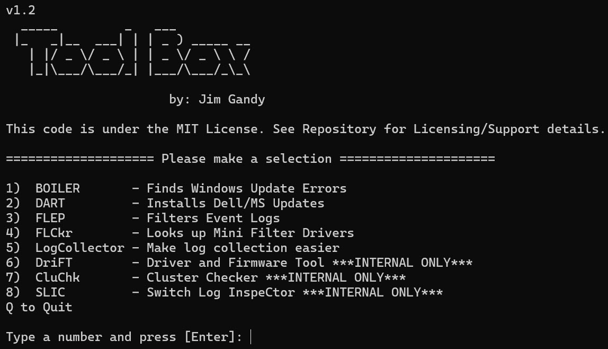
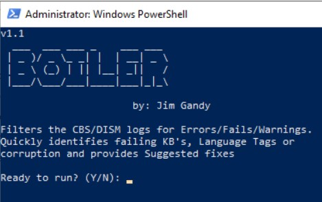
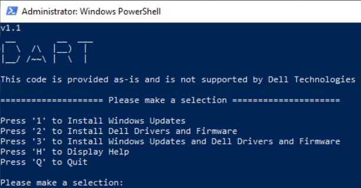
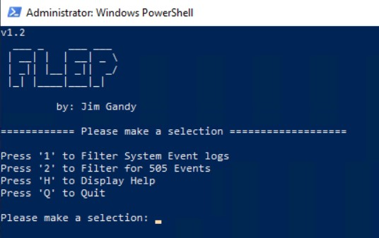
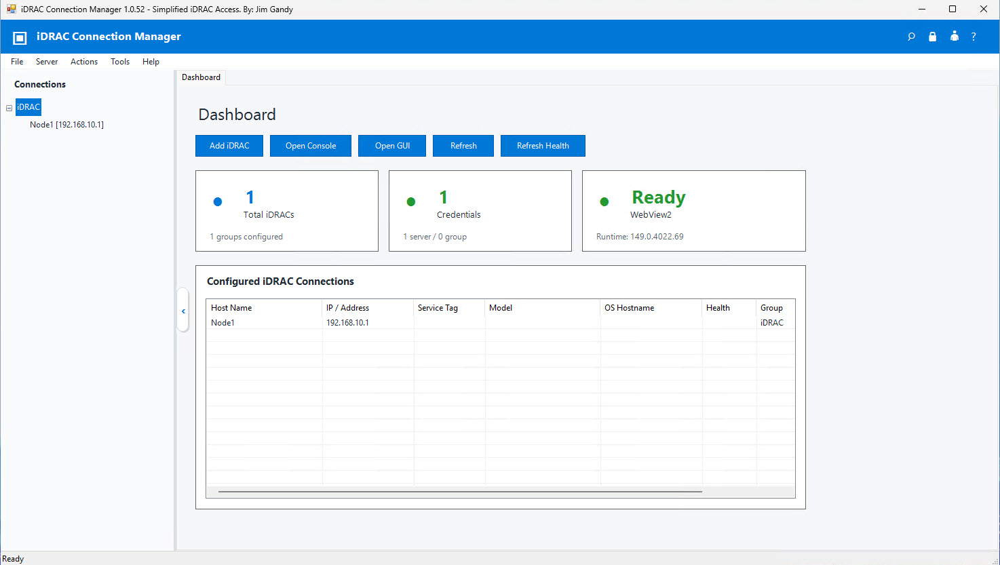
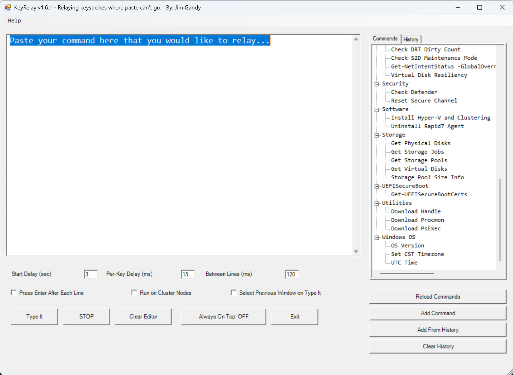
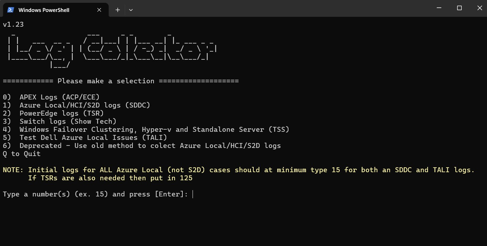
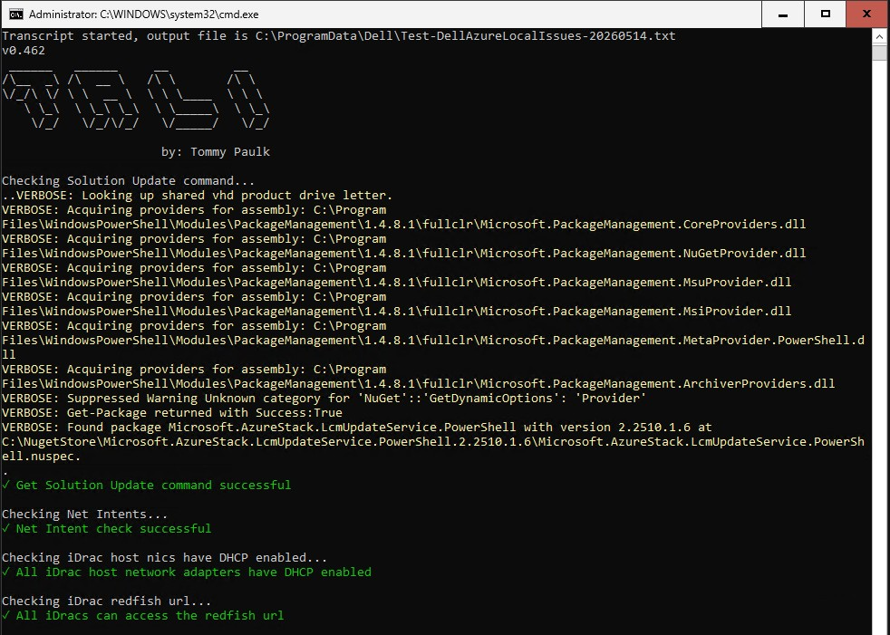

<p align="center">
  
</p>

<p align="center">
  <strong>PowerShell troubleshooting, diagnostics, log collection, and maintenance utilities for Dell PowerEdge, Windows Server, Hyper-V, and Azure Local environments.</strong>
</p>

<p align="center">
  
  
  
  
</p>

> [!CAUTION]
> These tools are provided **as-is** for troubleshooting, diagnostic, and convenience purposes. Review, test, and validate all scripts before using them in a production environment. **No official support or warranty is provided.**
>
> See [Disclaimer & Support](#-disclaimer--support) for details.

---

## 🚀 Quick Start

### 🧰 Dell ProSupport ToolBox

**Recommended for most users.** ToolBox provides one interface for launching the available support utilities.

> [!NOTE]
> Run PowerShell or PowerShell ISE **as Administrator** unless a tool specifically states otherwise.

```powershell
Echo ToolBox;[Net.ServicePointManager]::SecurityProtocol=[Net.SecurityProtocolType]::Tls12;Invoke-Expression('$module="ToolBox";$repo="PowershellScripts"'+(New-Object Net.WebClient).DownloadString('http'+'s://raw.g'+'ithubusercontent.com/DellProSupportGSE/Tools/main/ToolBox.ps1'));Invoke-ToolBox
```

<details>
<summary><strong>📖 ToolBox documentation and proxy troubleshooting</strong></summary>

<br>

ToolBox is the central launcher for the tools in this repository.



### Proxy error

If ToolBox cannot download scripts because the environment requires authenticated proxy access, try:

```powershell
$browser = New-Object System.Net.WebClient
$browser.Proxy.Credentials = [System.Net.CredentialCache]::DefaultNetworkCredentials
Echo ToolBox;[Net.ServicePointManager]::SecurityProtocol=[Net.SecurityProtocolType]::Tls12;Invoke-Expression('$module="ToolBox";$repo="PowershellScripts"'+(New-Object Net.WebClient).DownloadString('http'+'s://raw.g'+'ithubusercontent.com/DellProSupportGSE/Tools/main/ToolBox.ps1'));Invoke-ToolBox
```

</details>

---

## 🔎 Which Tool Should I Use?

| I need to... | Recommended tool |
|---|---|
| Launch utilities from one interface | 🧰 **[ToolBox](#-dell-prosupport-toolbox)** |
| Check Azure Local endpoint connectivity | 🔗 **[AzHCIUrlChecker](#-azhciurlchecker)** |
| Analyze CBS or DISM servicing failures and corruption | 🔥 **[BOILER](#-boiler)** |
| Automate Dell PowerEdge Server & Windows, drivers, and firmware updates | 🎯 **[DART](#-dart)** |
| Filter common Windows and storage events | 📈 **[FLEP](#-flep)** |
| Find Hyper-V performance bottlenecks | 🖥️ **[GetHyperVBottlenecks](#-gethypervbottlenecks)** |
| Manage access to multiple iDRACs | 🛠️ **[iDRAC Connection Manager](#-idrac-connection-manager)** |
| Send text to applications that block paste | ⌨️ **[KeyRelay](#-keyrelay)** |
| Collect Windows, PowerEdge Server, and Switch logs | 📦 **[LogCollector](#-logcollector)** |
| Collect Dell Switch show-tech output | 🧾 **[GetShowTech](#-getshowtech)** |
| Collect SDDC diagnostic data | 🩺 **[SDDC Dell Enhanced](#-sddc-dell-enhanced)** |
| Collect SDDC data WITHOUT direct internet access | 💾 **[SDDC Offline Dell Enhanced](#-sddc-offline-dell-enhanced)** |
| Collect TSRs from all cluster nodes | 📥 **[TSR Collector](#-tsr-collector)** |
| Test Azure Local clusters for common issues | ✅ **[TALI](#-tali)** |
| Check file-system filter driver altitudes | 🔎 **[FLCkr](#-flckr)** |
| Convert Windows ETL network traces to PCAP | 🌐 **[Convert-Etl2Pcap](#-convert-etl2pcap)** |

---

# 🧰 Tools

## 🔗 AzHCIUrlChecker

Checks connectivity to endpoints required by Azure Local noted [Microsoft Azure Local Documentation] https://learn.microsoft.com/en-us/azure/azure-local/concepts/firewall-requirements)  

**Best for:** firewall, proxy, and outbound connectivity troubleshooting.

```powershell
Echo AzHCIUrlChecker;[Net.ServicePointManager]::SecurityProtocol=[Net.SecurityProtocolType]::Tls12;Invoke-Expression('$module="AzHCIUrlChecker";$repo="PowershellScripts"'+(New-Object Net.WebClient).DownloadString('http'+'s://raw.g'+'ithubusercontent.com/DellProSupportGSE/Tools/main/AzHCIUrlChecker.ps1'));Invoke-AzHCIUrlChecker
```

---

## 🔥 BOILER

Analyzes **CBS** and **DISM** logs for errors, failures, warnings, failed KBs, language-pack issues, and corruption. BOILER also provides suggested remediation when recognized scenarios are detected.

**Best for:** Windows servicing, Windows Update, component-store, and DISM troubleshooting.

```powershell
[Net.ServicePointManager]::SecurityProtocol=[Net.SecurityProtocolType]::Tls12;Invoke-Expression('$module="BOILER";$repo="PowershellScripts"'+(New-Object Net.WebClient).DownloadString('http'+'s://raw.g'+'ithubusercontent.com/DellProSupportGSE/Tools/main/BOILER.ps1'));Invoke-BOILER
```

<details>
<summary><strong>📖 Documentation</strong></summary>

<br>



### Supported scenarios

- **Failing KBs** — identifies updates that are failing to install and may provide download and DISM installation guidance.
- **Failing language packs** — identifies failing language tags and provides repair guidance.
- **Component-store corruption** — highlights corruption found in servicing logs and suggested recovery steps.
- **Errors, failures, and warnings** — surfaces notable log entries when a known scenario is not detected.

### Basic workflow

1. Run BOILER.
2. Confirm that you are ready to begin.
3. Select the log or ZIP file to analyze.
4. Review the findings and suggested remediation.

BOILER supports analyzing local logs or supplied log files / ZIP archives.

</details>

---

## 🎯 DART

**Dell Automated Server Updater** is a Windows Failover Cluster and HCI/S2D-aware utility that can install Windows Updates and Dell driver / firmware updates.

> [!WARNING]
> ## **⚠️ Do Not Run on Azure Local POST deployment ⚠️**
>
> DART can make system changes, place cluster nodes into maintenance workflows, install updates, and trigger reboots. Review the tool behavior before using it in production.

```powershell
[Net.ServicePointManager]::SecurityProtocol=[Net.SecurityProtocolType]::Tls12;Invoke-Expression('$module="DART";$repo="PowershellScripts"'+(New-Object Net.WebClient).DownloadString('http'+'s://raw.g'+'ithubusercontent.com/DellProSupportGSE/Tools/main/DART.ps1'));Invoke-DART
```

<details>
<summary><strong>📖 Documentation</strong></summary>

<br>



DART can:

- Verify that it is running on a Dell server.
- Check for Dell System Update (DSU).
- Download and install DSU when required.
- Detect Azure Local / S2D and Windows Failover Cluster scenarios.
- Pause and drain cluster nodes when appropriate.
- Enable and disable storage maintenance mode where applicable.
- Install Windows updates on supported operating-system versions.
- Install Dell driver and firmware updates through DSU.
- Resume cluster nodes after maintenance.
- Create a post-reboot logon task when a reboot is required.
- Stop and report when an update fails.

### Logging

```text
C:\ProgramData\Dell\DART
```

### Optional parameters

```powershell
-IgnoreChecks:$True
```

Install updates without suspending the cluster node or enabling Azure Local storage maintenance mode.

```powershell
-IgnoreVersion:$True
```

Ignore the block on Dell updates when Microsoft Solution Update is deployed.

</details>

---

## 📈 FLEP

Filters Windows event logs for common server, failover-clustering, storage, and Storport events.

**Best for:** quickly narrowing large event logs to commonly relevant events.

```powershell
[Net.ServicePointManager]::SecurityProtocol=[Net.SecurityProtocolType]::Tls12;Invoke-Expression('$module="FLEP";$repo="PowershellScripts"'+(New-Object Net.WebClient).DownloadString('http'+'s://raw.g'+'ithubusercontent.com/DellProSupportGSE/Tools/main/FLEP.ps1'));Invoke-FLEP
```

<details>
<summary><strong>📖 Documentation</strong></summary>

<br>



FLEP can filter:

- Common System event IDs including `13`, `20`, `28`, `41`, `57`, `129`, `134`, `153`, `301`, `1001`, `1017`, `1018`, `1135`, `5120`, and `6003-6009`.
- Event ID `505` from `Microsoft-Windows-Storage-Storport/Operational` to review S2D / Azure Local storage latency buckets.

</details>

---

## 🖥️ GetHyperVBottlenecks

Detects potential performance bottlenecks in Hyper-V environments.

```powershell
[Net.ServicePointManager]::SecurityProtocol=[Net.SecurityProtocolType]::Tls12;Invoke-Expression('$module="GetHyperVBottlenecks";$repo="PowershellScripts"'+(New-Object Net.WebClient).DownloadString('http'+'s://raw.g'+'ithubusercontent.com/DellProSupportGSE/Tools/main/GetHyperVBottlenecks.ps1'));Invoke-GetHyperVBottlenecks
```

Run as Administrator and follow the interactive prompts.

---

## 🛠️ iDRAC Connection Manager

A PowerShell Windows Forms interface for organizing Dell servers and simplifying iDRAC GUI and console access.

```powershell
[Net.ServicePointManager]::SecurityProtocol=[Net.SecurityProtocolType]::Tls12;$wc=New-Object Net.WebClient;$wc.Encoding=[System.Text.Encoding]::UTF8;Invoke-Expression('$module="iDRACCMan";$repo="PowershellScripts"'+$wc.DownloadString('http'+'s://raw.g'+'ithubusercontent.com/DellProSupportGSE/Tools/main/iDRACCMan/iDRAC-ConnectionManager.ps1'))
```

<details>
<summary><strong>📖 Screenshot</strong></summary>

<br>



</details>

---

## ⌨️ KeyRelay

GUI utility for sending text to applications that do not allow normal clipboard paste operations.

```powershell
Echo KeyRelay;[Net.ServicePointManager]::SecurityProtocol=[Net.SecurityProtocolType]::Tls12;Invoke-Expression('$module="KeyRelay";$repo="PowershellScripts"'+(New-Object Net.WebClient).DownloadString('http'+'s://raw.g'+'ithubusercontent.com/DellProSupportGSE/Tools/main/KeyRelay.ps1'));Invoke-KeyRelay
```

<details>
<summary><strong>📖 Screenshot</strong></summary>

<br>



</details>

---

## 📦 LogCollector

Collects troubleshooting logs from Windows, Dell servers, and supported switches.

**Best for:** preparing diagnostic data for investigation or support cases.

```powershell
[Net.ServicePointManager]::SecurityProtocol=[Net.SecurityProtocolType]::Tls12;Invoke-Expression('$module="LogCollector";$repo="PowershellScripts"'+(New-Object System.Net.WebClient).DownloadString('http'+'s://raw.g'+'ithubusercontent.com/DellProSupportGSE/Tools/main/LogCollector.ps1'));Invoke-LogCollector
```

<details>
<summary><strong>📖 Screenshot</strong></summary>

<br>



</details>

---

## 🧾 GetShowTech

Collects Dell switch **show-tech** diagnostic output.

```powershell
[Net.ServicePointManager]::SecurityProtocol=[Net.SecurityProtocolType]::Tls12;Invoke-Expression('$module="GetShowTech";$repo="PowershellScripts"'+(New-Object System.Net.WebClient).DownloadString('http'+'s://raw.g'+'ithubusercontent.com/DellProSupportGSE/Tools/main/GetShowTech.ps1'));Invoke-GetShowTech
```

---

## 🩺 SDDC Dell Enhanced

Runs the SDDC diagnostic data-collection workflow.

```powershell
[Net.ServicePointManager]::SecurityProtocol=[Net.SecurityProtocolType]::Tls12;Invoke-Expression('$module="SDDC";$repo="PowershellScripts"'+(New-Object Net.WebClient).DownloadString('http'+'s://raw.g'+'ithubusercontent.com/DellProSupportGSE/Tools/main/RunSDDC.ps1'));Invoke-RunSDDC
```

---

## 💾 SDDC Offline Dell Enhanced

Use this workflow to collect SDDC diagnostic information when the target environment does not have direct internet access.

<details>
<summary><strong>📖 Offline collection procedure</strong></summary>

### 1. Prepare the SDDC package

On a machine with internet access:

1. Download the SDDC master archive from:
   `https://github.com/DellProSupportGse/PrivateCloud.DiagnosticInfo/archive/master.zip`
2. Transfer `master.zip` to the target cluster environment.

### 2. Transfer the script

Copy the contents of:

```text
http'+'s://raw.g'+'ithubusercontent.com/DellProSupportGSE/Tools/main/SDDCOffline.ps1
```

to the target environment.

### 3. Run the collection

1. Open PowerShell as Administrator.
2. Paste or run the `SDDCOffline.ps1` script.
3. Confirm execution when prompted.
4. Select the transferred `master.zip`.
5. Allow the tool to distribute and run the data collection.
6. Choose whether to retain or delete the copied master archive when prompted.

The resulting diagnostic package is written beneath the current user's profile and begins with `HealthTest`.

</details>

---

## 📥 TSR Collector

Collects a Dell Technical Support Report (TSRs) from all nodes in a cluster via the iDrac.

```powershell
[Net.ServicePointManager]::SecurityProtocol=[Net.SecurityProtocolType]::Tls12;Invoke-Expression('$module="TSRCollector";$repo="PowershellScripts"'+(New-Object Net.WebClient).DownloadString('http'+'s://raw.g'+'ithubusercontent.com/DellProSupportGSE/Tools/main/TSRCollector.ps1'));Invoke-TSRCollector
```

---

## ✅ TALI
## **⚠️ AZURE LOCAL ONLY — DO NOT RUN ON S2D ⚠️**
**Test-DellAzureLocalIssues** checks Dell Azure Local clusters for a broad set of common configuration, health, storage, networking, service, control-plane, and AKS Arc issues.

```powershell
Echo TALI;[Net.ServicePointManager]::SecurityProtocol=[Net.SecurityProtocolType]::Tls12;Invoke-Expression('$module="TALI";$repo="PowershellScripts"; '+(New-Object Net.WebClient).DownloadString('http'+'s://raw.g'+'ithubusercontent.com/DellProSupportGSE/Tools/main/TALI.ps1'));Test-DellAzureLocalIssues
```

<details>
<summary><strong>📖 What TALI checks</strong></summary>

<br>



TALI includes checks for areas such as:

- WMI, VMMS, and Cluster service health.
- Solution Update command availability.
- Network ATC / Net Intent configuration.
- iDRAC host NIC DHCP and Redfish connectivity.
- Node uptime.
- `HWTimeout` configuration.
- VM migration performance settings.
- Storage maintenance mode.
- Node time-zone consistency.
- Cluster shutdown timeout.
- Cluster-Aware Updating reports.
- Network Direct configuration.
- Azure Local VM migration failures.
- Required Azure Local services.
- Storage-pool capacity and thin-provisioning thresholds.
- N-1 memory resiliency.
- CPU overcommit risk.
- Physical-disk latency.
- `Get-HealthFault`.
- PowerShell module mismatches.
- Control-plane VM health.
- AKS Arc known issues.

TALI writes a transcript beneath:

```text
C:\ProgramData\Dell\
```

</details>

---

## 🔎 FLCkr

Checks installed file-system filter drivers against Microsoft's known allocated filter-altitude list.

```powershell
[Net.ServicePointManager]::SecurityProtocol=[Net.SecurityProtocolType]::Tls12;Invoke-Expression('$module="FLCkr";$repo="PowershellScripts"'+(New-Object System.Net.WebClient).DownloadString('http'+'s://raw.g'+'ithubusercontent.com/DellProSupportGSE/Tools/main/FLCkr.ps1'));Invoke-FLCkr
```

---

## 🌐 Convert-Etl2Pcap

Converts Windows ETL network traces to PCAP format for analysis in Wireshark and other packet-analysis tools.

```powershell
[Net.ServicePointManager]::SecurityProtocol=[Net.SecurityProtocolType]::Tls12;Invoke-Expression('$module="Convert-Etl2Pcap";$repo="PowershellScripts"'+(New-Object Net.WebClient).DownloadString('http'+'s://raw.g'+'ithubusercontent.com/DellProSupportGSE/Tools/main/Convert-Etl2Pcap.ps1'));Invoke-ETL2PCAP
```

---

<br>
<br>

## 🗃️ No Longer Maintained

The following utilities remain available for historical or specialized use but are **not actively maintained**.

### ☁️ APEX VM Log Collection

Collects logs from an APEX virtual machine.

```bash
curl -sSL http'+'s://raw.g'+'ithubusercontent.com/DellProSupportGSE/Tools/main/log_collect.sh -o ./log_collect.sh && chmod 755 log_collect.sh && bash ./log_collect.sh
```

Run from an elevated / root shell on the APEX VM.

### 💿 Make ISO

Converts a folder into an ISO image.

```powershell
Echo MakeIso;[Net.ServicePointManager]::SecurityProtocol=[Net.SecurityProtocolType]::Tls12;Invoke-Expression('$module="MakeIso";$repo="PowershellScripts"'+(New-Object Net.WebClient).DownloadString('http'+'s://raw.g'+'ithubusercontent.com/DellProSupportGSE/Tools/main/isomaker.ps1'));Invoke-MakeISO
```

---

## ⚠️ Disclaimer & Support

These tools are provided **"as-is"** for informational, troubleshooting, diagnostic, and convenience purposes only.

No warranties, guarantees, or representations are made regarding their accuracy, reliability, functionality, compatibility, or suitability for any particular purpose.

Use of these tools is **at your own risk**. You are responsible for reviewing, testing, and validating any scripts, commands, or changes before using them in a production environment.

**No official support is provided for these tools.** Issues, failures, data loss, service interruption, system changes, or other consequences resulting from their use are the responsibility of the user.

These tools are not a replacement for official product documentation, supported utilities, or established support processes.

If you identify a problem or have an improvement, use the repository's **Issues** section to document it for the community.

---

## ⚖️ License

This repository is made available under the terms of its included license. See the repository license file for the applicable terms.

---

<p align="center">
  <strong>Dell ProSupport Tools</strong><br>
  Windows Server • Azure Local • Hyper-V • Dell PowerEdge
</p>
