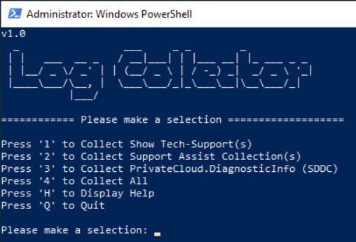

# Tools
  NOTE: All tools should be run from ISE as administorator unless otherwise noted. 

### Support
  Please note this code is provided as-is and currently not supported by Dell EMC.

-------------------------------------------------------------------------------------------------------------------------------------------------
## DART
   **D**ell **A**utomated se**R**ver upda**T**er is a Windows Failover Cluster and HCI/S2D aware tool that will automatically download and 
   install Windows Updates, Drivers/Firmware on Dell Servers.
  
  
  
  How To Use:
    From PowerShell as admin execute the following:
```Powershell
[Net.ServicePointManager]::SecurityProtocol = [Net.SecurityProtocolType]::Tls12;Invoke-Expression('$module="DART";$repo="PowershellScripts"'+(new-object net.webclient).DownloadString('https://raw.githubusercontent.com/DellProSupportGse/Tools/main/DART.ps1'));Invoke-DART
```

### Documentation:
   1. Checks to make sure your running on a Dell server
   2. Checks to see if have the latest Dell System Update is installed
   3. If not then it downloads and installs the latest version of DSU
   4. Is Azure Stack HCI (Storage Spaces Direct Ready Node or AX node)
      - We download and extract the AZHCI-Catalog to use with DSU
      - We Pause & Drain the node and Enable Storage Maintenance Mode
      - Installs Windows Updates
      - Runs DSU
        - No reboot required: We resume the node, disable Storage Maintenance Mode and show Installation Report
        - Reboot Required: We setup a logon task that will resume the node and disable Storage Maintenance Mode after the reboot and logon
        - Failed Update: We show you the failed update and exit so we can look into the errors and decide how to proceed.
   6. Is Cluster member
      - We Pause & Drain the node and Enable Storage Maintenance Mode
      - Installs Windows Updates
      - Runs DSU
        - No reboot required: We resume the node and show Installation Report
        - Reboot Required: We setup a logon task that will resume the node after the reboot and logon
        - Failed Update: We show you the failed update and exit so we can look into the errors and decide how to proceed.
   8. Is Regular Power Edge Server
      - Installs Windows Updates 
      - Runs DSU
        - No reboot required: Show Installation Report
        - Failed Update: We show you the failed update and exit so we can look into the errors and decide how to proceed.
   
   Transcript Logging: C:\ProgramData\Dell\DART
   
   Use -IgnoreChecks:$True to install updates without suspending cluster node or enabling storage maintenance mode for Azure Stack HCI
   
-------------------------------------------------------------------------------------------------------------------------------------------------
## LogCollector
   
   This tool is used to collect all the logs Switches, Servers and OS
   
   
   
   How To Use: 
      From PowerShell as admin execute the following and follow the prompts:
```Powershell
[Net.ServicePointManager]::SecurityProtocol = [Net.SecurityProtocolType]::Tls12;Invoke-Expression('$module="LogCollector";$repo="PowershellScripts"'+(new-object System.net.webclient).DownloadString('https://raw.githubusercontent.com/DellProSupportGse/Tools/main/LogCollector.ps1'));Invoke-LogCollector
```
-------------------------------------------------------------------------------------------------------------------------------------------------
## GetShowTech
   
   This tool is used to collect Dell switch logs
   
   How To Use: 
      From PowerShell as admin execute the following and follow the prompts:
```Powershell
[Net.ServicePointManager]::SecurityProtocol = [Net.SecurityProtocolType]::Tls12;Invoke-Expression('$module="GetShowTech";$repo="PowershellScripts"'+(new-object System.net.webclient).DownloadString('https://raw.githubusercontent.com/DellProSupportGse/Tools/main/GetShowTech.ps1'));Invoke-GetShowTech
```
-------------------------------------------------------------------------------------------------------------------------------------------------
## Run SDDC
 How To Use:
    From ISE or PowerShell as admin execute the following:
```Powershell
[Net.ServicePointManager]::SecurityProtocol = [Net.SecurityProtocolType]::Tls12;Invoke-Expression('$module="SDDC";$repo="PowershellScripts"'+(new-object net.webclient).DownloadString('https://raw.githubusercontent.com/DellProSupportGse/Tools/main/RunSDDC.ps1'));Invoke-RunSDDC
```

---
-------------------------------------------------------------------------------------------------------------------------------------------------
## SDDC Offline
 
 How To Use:
 
    1. Download the SDDC from this link <https://github.com/DellProSupportGse/PrivateCloud.DiagnosticInfo/archive/master.zip>
    2. Copy to the node where you will run it
    3. Open SDDCOffline <https://raw.githubusercontent.com/DellProSupportGse/Tools/main/SDDCOffline.ps1> and copy/paste into ISE on the node where you want to run SDDC
    4. Run the copied code
    5. It will ask you for the location of the downloaded SDDC from step 1 ans 2
    6. The rest will run as normal
   
-------------------------------------------------------------------------------------------------------------------------------------------------
## TSR Collector
   This tool is used to collect TSRs from
    all nodes in a cluster"

  How To Use:
    From ISE or PowerShell as admin execute the following:
```Powershell
[Net.ServicePointManager]::SecurityProtocol = [Net.SecurityProtocolType]::Tls12;Invoke-Expression('$module="TSRCollector";$repo="PowershellScripts"'+(new-object net.webclient).DownloadString('https://raw.githubusercontent.com/DellProSupportGse/Tools/main/TSRCollector.ps1'));Invoke-TSRCollector
```
-------------------------------------------------------------------------------------------------------------------------------------------------
## FLCkr
   **FL**tmc **C**hec**k**e**r**
   This tool lookups up filter drivers in Microsoft's known good list
   URL: https://raw.githubusercontent.com/MicrosoftDocs/windows-driver-docs/staging/windows-driver-docs-pr/ifs/allocated-altitudes.md
   
   How To Use: 
      From ISE or PowerShell as admin execute the following and follow the prompts:
```Powershell
[Net.ServicePointManager]::SecurityProtocol = [Net.SecurityProtocolType]::Tls12;Invoke-Expression('$module="FLCkr";$repo="PowershellScripts"'+(new-object System.net.webclient).DownloadString('https://raw.githubusercontent.com/DellProSupportGse/Tools/main/FLCkr.ps1'));Invoke-FLCkr
```
-------------------------------------------------------------------------------------------------------------------------------------------------

### Report problems or provide feedback
If you run into any problems or would like to provide feedback, please open an issue here https://github.com/DellProSupportGse/Tools/issues
