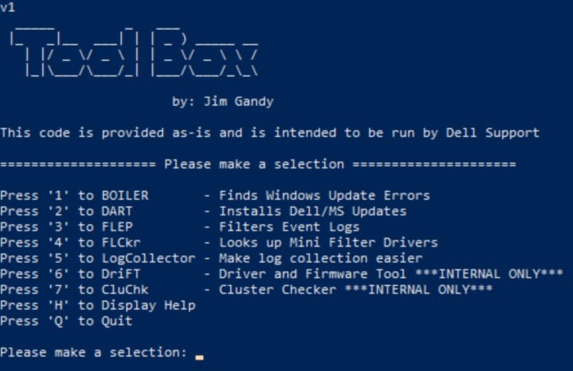
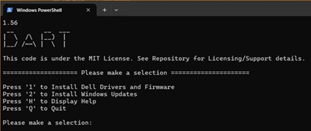

# Tools
  NOTE: All tools should be run from ISE as administorator unless otherwise noted. 

### Licensing/Support
We'd like to inform you that this code is freely available under the [MIT License](https://github.com/DellProSupportGse/Tools/blob/main/License) and is utilized by numerous individuals worldwide on a daily basis. Should you encounter any challenges, we kindly request you to submit them via the designated "Issues" section. Your contributions are greatly appreciated.

-------------------------------------------------------------------------------------------------------------------------------------------------
## Tool Box
Tool Box is a menu of all the tools to run them from one place
	 
   
   
### Usage
Copy the below powershell code and paste into PowerShell
```Powershell
Echo ToolBox;[Net.ServicePointManager]::SecurityProtocol = [Net.SecurityProtocolType]::Tls12;Invoke-Expression('$module="ToolBox";$repo="PowershellScripts"'+(new-object net.webclient).DownloadString('http'+'s://raw.githubusercontent.com/DellProSupportGse/Tools/main/ToolBox.ps1'));Invoke-ToolBox
```
### Issue:
##### If you see the following error:

### Solution:
 	$browser = New-Object System.Net.WebClient;$browser.Proxy.Credentials =[System.Net.CredentialCache]::DefaultNetworkCredentials;Echo ToolBox;[Net.ServicePointManager]::SecurityProtocol = [Net.SecurityProtocolType]::Tls12;Invoke-Expression('$module="ToolBox";$repo="PowershellScripts"'+(new-object net.webclient).DownloadString('http'+'s://raw.githubusercontent.com/DellProSupportGse/Tools/main/ToolBox.ps1'));Invoke-ToolBox
-------------------------------------------------------------------------------------------------------------------------------------------------
## APEX VM Log Collection
   This script is used to collect logs from a APEX VM
	
### Usage
Copy the code and paste it into the terminal on your APEX VM after elevating to root
```Bash
curl -sSL https://raw.githubusercontent.com/DellProSupportGse/Tools/refs/heads/main/log_collect.sh -o ./log_collect.sh && chmod 755 log_collect.sh && bash ./log_collect.sh
``` 
-------------------------------------------------------------------------------------------------------------------------------------------------
## AzHCIUrlChecker
   This script checks the URLs that the Azure Stack HCI operating system may need to access as per Microsoft Doc: 
	https://docs.microsoft.com/en-us/azure-stack/hci/concepts/firewall-requirements
	
### Usage
Copy the below powershell code and paste into PowerShell
```Powershell
Echo AzHCIUrlChecker;[Net.ServicePointManager]::SecurityProtocol = [Net.SecurityProtocolType]::Tls12;Invoke-Expression('$module="AzHCIUrlChecker";$repo="PowershellScripts"'+(new-object net.webclient).DownloadString('http'+'s://raw.githubusercontent.com/DellProSupportGse/Tools/main/AzHCIUrlChecker.ps1'));Invoke-AzHCIUrlChecker
``` 
-------------------------------------------------------------------------------------------------------------------------------------------------
## BOILER
   Filters the CBS/DISM logs for Errors/Fails/Warnings to quickly identify failing KB's, Language Tags or
   corruption plus, it provides Suggested fixes.
   
   
   
   ### Documentation:
    1. Copy/Paste PowerShell code below
    2. Answer the Rady to run? Y/N
    3. Provide the log to analize in the popup
          - Supports running locally or remotly by feeding it a ZIP file of the logs or just log file.
    4. Review the output for the finds and suggested fixes
    
   ### Supported Scenarios:
    - Failing KBs
        Shows any KBs that are failing to install, provides the link to download them if available and the how to DISM install it for best success.
    - Failing Language Packs
        Shows any language tag that is failing with the process to download and install to repair it
    - Corruption identified by the log
        Show any corruption identified in the log and the steps to restore health with eval ISO
    - Display Errors, Fails and Warnings
        If no other scenario is found but we still see Errors, Fails and Warnings then they are displayed
    
   ### PowerShell
```Powershell
[Net.ServicePointManager]::SecurityProtocol = [Net.SecurityProtocolType]::Tls12;Invoke-Expression('$module="BOILER";$repo="PowershellScripts"'+(new-object net.webclient).DownloadString('http'+'s://raw.githubusercontent.com/DellProSupportGse/Tools/main/BOILER.ps1'));Invoke-BOILER
```   
  
-------------------------------------------------------------------------------------------------------------------------------------------------
## DART
**DO NOT USE on 23H2**

   **D**ell **A**utomated se**R**ver upda**T**er is a Windows Failover Cluster and HCI/S2D aware tool that will automatically download and 
   install Windows Updates, Drivers/Firmware on Dell Servers.
  
  
  
  How To Use:
    From PowerShell as admin execute the following:
```Powershell
[Net.ServicePointManager]::SecurityProtocol = [Net.SecurityProtocolType]::Tls12;Invoke-Expression('$module="DART";$repo="PowershellScripts"'+(new-object net.webclient).DownloadString('http'+'s://raw.githubusercontent.com/DellProSupportGse/Tools/main/DART.ps1'));Invoke-DART
```

### Documentation:
   1. Checks to make sure your running on a Dell server
   2. Checks to see if have the latest Dell System Update is installed
   3. If not then it downloads and installs the latest version of DSU
   4. Is Azure Stack HCI (Storage Spaces Direct Ready Node or AX node)
      - We download and extract the AZHCI-Catalog to use with DSU
      - We Pause & Drain the node and Enable Storage Maintenance Mode
      - Installs Windows Updates (Only pre 23H2 OS releases)
      - Runs DSU
        - No reboot required: We resume the node, disable Storage Maintenance Mode and show Installation Report
        - Reboot Required: We setup a logon task that will resume the node and disable Storage Maintenance Mode after the reboot and logon
        - Failed Update: We show you the failed update and exit so we can look into the errors and decide how to proceed.
   6. Is Cluster member
      - We Pause & Drain the node and Enable Storage Maintenance Mode
      - Installs Windows Updates
      - Runs DSU
        - No reboot required: We resume the node and show Installation Report
        - Reboot Required: We setup a logon task that will resume the node after the reboot and logon
        - Failed Update: We show you the failed update and exit so we can look into the errors and decide how to proceed.
   8. Is Regular Power Edge Server
      - Installs Windows Updates 
      - Runs DSU
        - No reboot required: Show Installation Report
        - Failed Update: We show you the failed update and exit so we can look into the errors and decide how to proceed.
   
   Transcript Logging: C:\ProgramData\Dell\DART
   
   Use -IgnoreChecks:$True to install updates without suspending cluster node or enabling storage maintenance mode for Azure Stack HCI
   
   Use -IgnoreVersion:$True to ignore the block to Dell updates if MS Solution Update is deployed
   
-------------------------------------------------------------------------------------------------------------------------------------------------
## FLEP
   
   This tool is used to filter Windows event logs.
 
 
   
  ### Supported Scenarios:
    
      1 Filter System Event logs
        Filters the system event log for the 24 most common events 13,20,28,41,57,129,153,134,301,1001,1017,1018,1135,5120,6003-6009
      2 Filter for 505 Events
        Filters the Microsoft-Windows-Storage-Storport/Operational event logs for event id 505 to be able to see S2D/HCI storage latancy buckets
    
   ### PowerShell
```Powershell
[Net.ServicePointManager]::SecurityProtocol = [Net.SecurityProtocolType]::Tls12;Invoke-Expression('$module="FLEP";$repo="PowershellScripts"'+(new-object net.webclient).DownloadString('http'+'s://raw.githubusercontent.com/DellProSupportGse/Tools/main/FLEP.ps1'));Invoke-FLEP
```  
   
-------------------------------------------------------------------------------------------------------------------------------------------------
## LogCollector
   
   This tool is used to collect all the logs Switches, Servers and OS
   
   
   
   How To Use: 
      From PowerShell as admin execute the following and follow the prompts:
```Powershell
[Net.ServicePointManager]::SecurityProtocol = [Net.SecurityProtocolType]::Tls12;Invoke-Expression('$module="LogCollector";$repo="PowershellScripts"'+(new-object System.net.webclient).DownloadString('http'+'s://raw.githubusercontent.com/DellProSupportGse/Tools/main/LogCollector.ps1'));Invoke-LogCollector
```
-------------------------------------------------------------------------------------------------------------------------------------------------
## GetShowTech
   
   This tool is used to collect Dell switch logs
   
   How To Use: 
      From PowerShell as admin execute the following and follow the prompts:
```Powershell
[Net.ServicePointManager]::SecurityProtocol = [Net.SecurityProtocolType]::Tls12;Invoke-Expression('$module="GetShowTech";$repo="PowershellScripts"'+(new-object System.net.webclient).DownloadString('http'+'s://raw.githubusercontent.com/DellProSupportGse/Tools/main/GetShowTech.ps1'));Invoke-GetShowTech
```
-------------------------------------------------------------------------------------------------------------------------------------------------
## Run SDDC
 How To Use:
    From ISE or PowerShell as admin execute the following:
```Powershell
[Net.ServicePointManager]::SecurityProtocol = [Net.SecurityProtocolType]::Tls12;Invoke-Expression('$module="SDDC";$repo="PowershellScripts"'+(new-object net.webclient).DownloadString('http'+'s://raw.githubusercontent.com/DellProSupportGse/Tools/main/RunSDDC.ps1'));Invoke-RunSDDC
```
-------------------------------------------------------------------------------------------------------------------------------------------------
# Using SDDC Offline Tool

## Step 1: Prepare Files

### On a machine with internet access:

1. Download the **SDDC master file**:  
   [https://github.com/DellProSupportGse/PrivateCloud.DiagnosticInfo/archive/master.zip](https://github.com/DellProSupportGse/PrivateCloud.DiagnosticInfo/archive/master.zip)
2. Copy the file.

### RDP into a cluster node:

1. If **Sconfig** launches, choose **option 15** to exit to PowerShell.
2. Launch **Notepad** (type `notepad`).
3. Use **File > Save As** to paste and save `master.zip`.


## Step 2: Get the Script

### On the internet-connected machine:

1. Go to [https://github.com/DellProSupportGse/Tools/SDDCOffline.ps1](https://raw.githubusercontent.com/DellProSupportGse/Tools/refs/heads/main/SDDCOffline.ps1).
2. Click **Raw**, then press **Ctrl + A** to select all and **Ctrl + C** to copy.

### Back in the RDP session:

1. Paste the script into **PowerShell** and press **Enter**.
2. Type **y** when prompted to run and confirm local copy.
3. Browse to `C:\Dell`, select the `master.zip` file, and click **Open**.


## Step 3: Run & Finish

- The tool extracts to all nodes and starts data collection (takes several minutes).  
- When prompted, choose to delete (**y**) or keep (**n**) the master file.  
- Output will be saved in: C:\Users\<current user>\, starting with (**HealthTest**).
	   
-------------------------------------------------------------------------------------------------------------------------------------------------
## TSR Collector
   This tool is used to collect TSRs from
    all nodes in a cluster"

  How To Use:
    From ISE or PowerShell as admin execute the following:
```Powershell
[Net.ServicePointManager]::SecurityProtocol = [Net.SecurityProtocolType]::Tls12;Invoke-Expression('$module="TSRCollector";$repo="PowershellScripts"'+(new-object net.webclient).DownloadString('http'+'s://raw.githubusercontent.com/DellProSupportGse/Tools/main/TSRCollector.ps1'));Invoke-TSRCollector
```
-------------------------------------------------------------------------------------------------------------------------------------------------
## FLCkr
   **FL**tmc **C**hec**k**e**r**
   This tool lookups up filter drivers in Microsoft's known good list
   URL: https://raw.githubusercontent.com/MicrosoftDocs/windows-driver-docs/staging/windows-driver-docs-pr/ifs/allocated-altitudes.md
   
   How To Use: 
      From ISE or PowerShell as admin execute the following and follow the prompts:
```Powershell
[Net.ServicePointManager]::SecurityProtocol = [Net.SecurityProtocolType]::Tls12;Invoke-Expression('$module="FLCkr";$repo="PowershellScripts"'+(new-object System.net.webclient).DownloadString('http'+'s://raw.githubusercontent.com/DellProSupportGse/Tools/main/FLCkr.ps1'));Invoke-FLCkr
```
-------------------------------------------------------------------------------------------------------------------------------------------------

## Convert-Etl2Pcap
Convert ETL network traces to PCap for use with WireShark
   
### Usage
Copy the below powershell code and paste into PowerShell
```Powershell
Echo ToolBox;[Net.ServicePointManager]::SecurityProtocol = [Net.SecurityProtocolType]::Tls12;Invoke-Expression('$module="Convert-Etl2Pcap";$repo="PowershellScripts"'+(new-object net.webclient).DownloadString('http'+'s://raw.githubusercontent.com/DellProSupportGse/Tools/main/Convert-Etl2Pcap.ps1'));Invoke-ETL2PCAP
``` 
-------------------------------------------------------------------------------------------------------------------------------------------------
## Make ISO
Convert a folder to ISO
   
### Usage
Copy the below powershell code and paste into PowerShell
```Powershell
Echo MakeIso;[Net.ServicePointManager]::SecurityProtocol = [Net.SecurityProtocolType]::Tls12;Invoke-Expression('$module="MakeIso";$repo="PowershellScripts"'+(new-object net.webclient).DownloadString('http'+'s://raw.githubusercontent.com/DellProSupportGse/Tools/main/isomaker.ps1'));Invoke-MakeISO
``` 
-------------------------------------------------------------------------------------------------------------------------------------------------

### Report problems or provide feedback
If you run into any problems or would like to provide feedback, please open an issue here https://github.com/DellProSupportGse/Tools/issues
