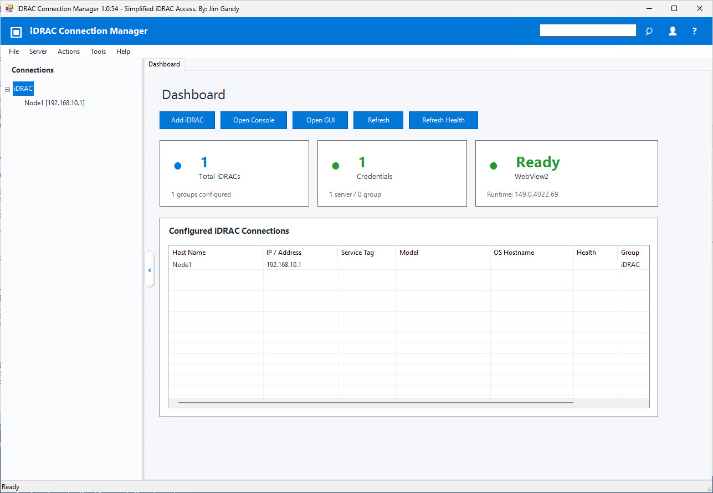

## iDRAC Connection Manager
   
   iDRACCMan provides simplified iDRAC access using PowerShell Windows Forms interface for managing Dell iDRAC
    GUI and console sessions from a grouped server tree.
   
   
   
   How To Use: 
      From PowerShell as admin execute the following and follow the prompts:
```Powershell
[Net.ServicePointManager]::SecurityProtocol=[Net.SecurityProtocolType]::Tls12;$wc=New-Object Net.WebClient;$wc.Encoding=[System.Text.Encoding]::UTF8;Invoke-Expression('$module="iDRACCMan";$repo="PowershellScripts"'+$wc.DownloadString('http'+'s://raw.githubusercontent.com/DellProSupportGse/Tools/refs/heads/main/iDRACCMan/iDRAC-ConnectionManager.ps1'))
```
